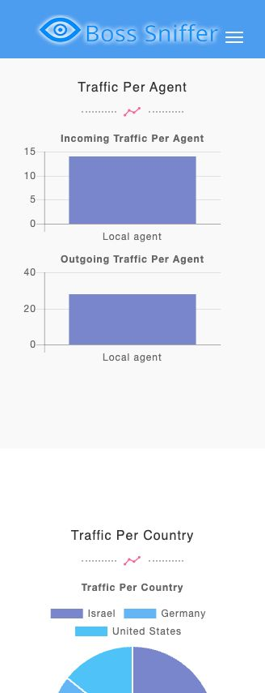

# Boss Sniffer

[](https://github.com/ophbra22/boss-sniffer/actions/workflows/tests.yml)

A Python network traffic analyzer. A local agent captures IPv4 TCP/UDP packet metadata, sends it to a manager over TCP, and generates an HTML dashboard with traffic statistics and IP blacklist alerts.

This repository preserves the original three-part architecture and dashboard, with compatibility fixes, clearer setup, and regression tests.



## What it does

- Captures incoming and outgoing IPv4 TCP/UDP traffic on one local interface.
- Groups traffic by remote IP, remote port, country, and application.
- Shows packet counts and the three most frequent entries in each category.
- Flags traffic matching a configurable IP blacklist.
- Produces a local HTML report with bundled chart assets.

**Stack:** Python · Scapy · sockets · JSON · HTML/CSS · Chart.js

## Try the demo

The demo uses synthetic data and needs only **Python 3.10+**. No administrator access, packet capture, or third-party Python packages are needed.

```bash
git clone https://github.com/ophbra22/boss-sniffer.git
cd boss-sniffer
python3 manager.py --demo
```

Open `output/report.html` in your browser. On Windows, use `py` instead of `python3`. The dashboard works offline; the demo contains 42 packets: 14 incoming and 28 outgoing, including one blacklist match. The IPs, country labels, applications, and MAC addresses in this sample are fictional.

## Capture live traffic

Only capture traffic on systems and networks you are authorized to monitor.

Create a virtual environment and install the dependencies:

```bash
python3 -m venv .venv
source .venv/bin/activate
python -m pip install -r requirements.txt
```

On Windows (PowerShell):

```powershell
py -m venv .venv
.venv\Scripts\Activate.ps1
python -m pip install -r requirements.txt
```

Start the manager in the first terminal:

```bash
python manager.py
```

Start the agent in another terminal using the same environment. On macOS/Linux, packet capture usually requires elevated privileges:

```bash
sudo .venv/bin/python agent.py
```

On Windows, install [Npcap](https://npcap.com/#download), then run `.venv\Scripts\python.exe agent.py` from an Administrator terminal. See the [Scapy platform setup guide](https://scapy.readthedocs.io/en/latest/installation.html) for capture prerequisites.

Each capture batch ends after 500 packets or 10 seconds, then sends its metadata to the manager. Open `output/report.html` and refresh it to see each update. Stop both processes with `Ctrl+C`.

Useful options:

```bash
# Choose an interface; substitute your actual interface name.
sudo .venv/bin/python agent.py --interface en0 --count 100 --timeout 5 --once

# Override the local address for the selected interface when necessary.
sudo .venv/bin/python agent.py --interface en0 --local-ip 192.168.1.10

# Use a different loopback port in both terminals.
python manager.py --port 3334
sudo .venv/bin/python agent.py --port 3334
```

Use `python agent.py --help` or `python manager.py --help` for all options.

## Configuration

Copy `settings.example.dat` to `settings.dat` to customize the local agent label and IP blacklist:

```ini
WORKERS = local-agent:127.0.0.1
BLACKLIST = 203.0.113.10:example-blocked-host
```

`WORKERS` retains the original configuration format and supplies the label for blacklist alerts. This version aggregates **one local agent**; it does not attribute traffic to multiple workers. Without a local settings file, the included example is used. You can also pass `--settings path/to/settings.dat` to the manager.

Local settings, generated reports, virtual environments, and packet captures are excluded from Git.

## How it works

```text
Network interface
       │ Scapy: IPv4 TCP/UDP packet metadata
       ▼
   agent.py
       │ JSON batch over TCP (127.0.0.1:3333)
       ▼
  manager.py ──► report.py ──► output/report.html
```

Each batch keeps the original format:

```json
{
  "198.51.100.10": [
    [443, "True", 60, "Unknown", "Unknown", "02:00:00:00:00:02"]
  ]
}
```

The six fields are **remote port, outgoing flag, packet length, country, program, and link-layer peer MAC**. `"True"` means outgoing; `"False"` means incoming. The peer MAC is generally a local next hop, not the remote Internet host. Packet payloads are not sent to the manager. One connection carries one UTF-8 JSON batch, with end-of-stream marking its end.

```text
agent.py                 Capture and send packet metadata
manager.py               Receive batches or generate the demo
report.py                Aggregate statistics and render HTML
settings.example.dat     Example configuration
samples/traffic.json     Synthetic demonstration data
templates/report.html    Original dashboard template
assets/                  Dashboard CSS, JavaScript, images, and fonts
tests/                   Regression and local TCP integration tests
docs/                    Screenshot and maintenance notes
```

## Tests

After installing `requirements.txt`:

```bash
python -m unittest discover -s tests -v
```

Tests cover packet direction and remote ports, short captures, missing Ethernet headers, geolocation failures, fragmented TCP messages, malformed batches, blacklist matching, report escaping, and a full local agent-to-report flow. They use synthetic packets and loopback sockets; no live capture or external API access is required. GitHub Actions runs them on Linux, macOS, and Windows with Python 3.10 and 3.14.

## Scope and limitations

- Live capture depends on OS permissions and capture drivers. Synthetic tests do not prove live capture on every platform.
- Application detection retains the original Windows `netstat -nb` approach. It is best effort; on macOS/Linux or when no process is found, it shows `Unknown`.
- Country lookup is disabled by default. `--geolocate` uses the original `ip-api.com` HTTP service and sends observed public IP addresses to that service. Private/reserved addresses and failed or rate-limited lookups display `Unknown`.
- The manager listens only on loopback and has no authentication. It is intended for a local educational demo, not deployment as a public service.
- Captures cover one IPv4 interface. IPv6, packet payload inspection, multi-agent attribution, persistent storage, and live browser refresh are outside this project's scope.
- The manager retains records in memory for its current session. Restart it between short captures; long sessions can use increasing memory and report-generation time.
